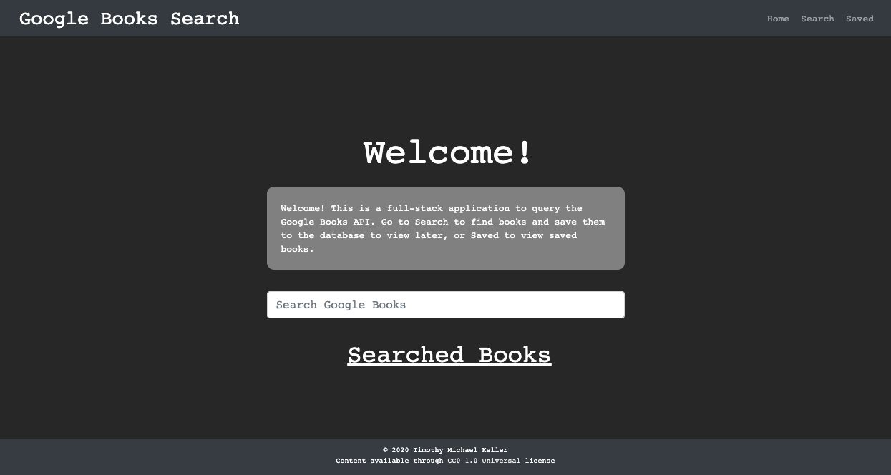
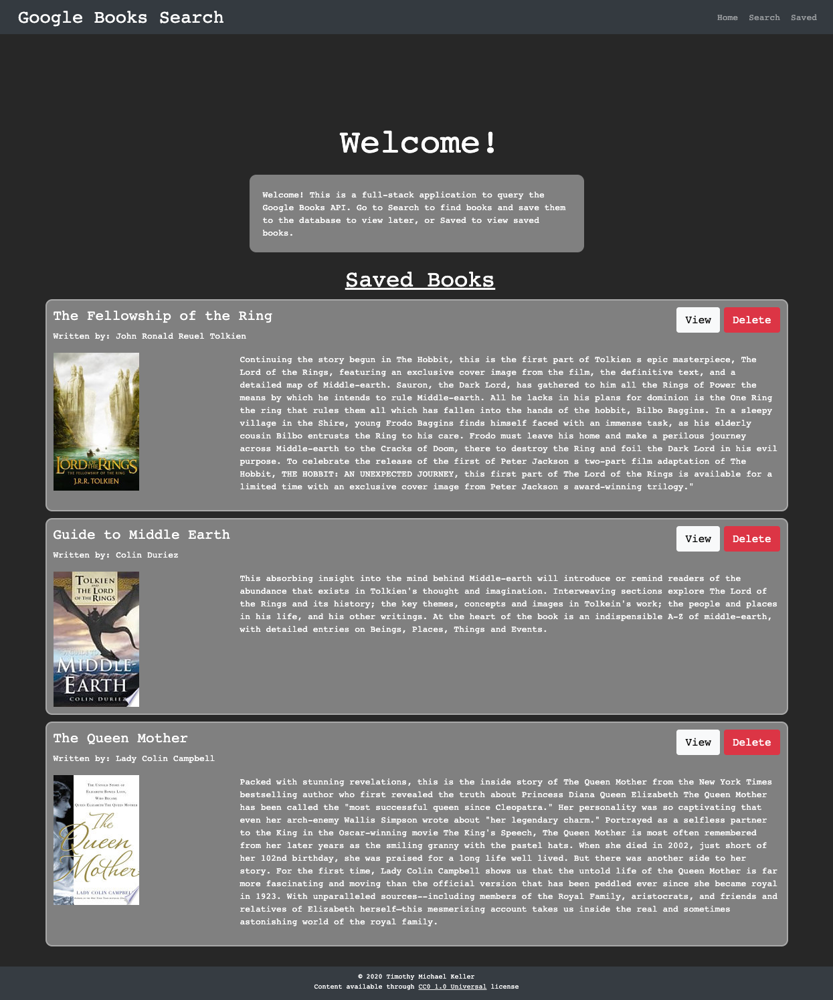

# Google Books Search

## Table of Contents
1. [Description](#description)
2. [Installation](#installation)
3. [Technologies](#technologies)
4. [Usage](#usage)
5. [Contributing](#contributing)
6. [Tests](#tests)
7. [Questions](#questions)
8. [License](#license)
## Description
A full-stack MERN app that queries Google Books and allows the user to store their choices in a Mongo database. Uses MongoDB/Mongoose, Express, Express Router DOM, React, Node, Bootstrap, and Axios.

## Installation
Clone from git into your chosen directory on your local computer. Go to the root directory of the repository and type npm i to install all backend dependencies, then go to the client folder in terminal and type npm i to install all front-end dependencies.

## Technologies

## Usage
Type npm start in the root directory if you wish to initialize the app on your localhost, and make sure Mongo is running (mongod for Mac users). This app consists of only two pages, Search, and Saved. Typing in a query in Search will result in a list of books being populated below the search field. You can continue to search for what you want, use, the view button to see the Google link for it, or click "Save" to save it to the database. Now go to the Saved page, and you'll see a list of all books saved to the database. You can click the View button here as well to visit the Google link, or click "Delete" to remove it from the database.

[Deployed App](https://tmk-google-books-search.herokuapp.com/)

## Contributing
Fork this repository at https://github.com/tmkeller/google-books-search, and email me at timothy.m.keller@gmail.com to discuss pull requests.

## Tests
No testing suite is currently designated.

## Questions
Written by [tmkeller](https://github.com/tmkeller) on Github.
Email the author at timothy.m.keller@gmail.com.

## License
[CC0](http://creativecommons.org/publicdomain/zero/1.0/)